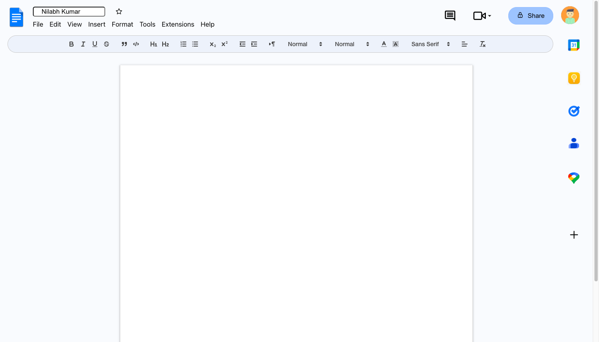

# Google Docs Clone

A Google Docs clone built with React, utilizing the `useEffect` hook and Quill for the text editor toolbar.

Link of the Project -https://googledocs-nilabh.netlify.app/




## Introduction

This is a simple web application that mimics the functionality and user interface of Google Docs. It allows users to create, edit, and collaborate on documents in real time. T
he application is built using React, and the `useEffect` hook is used to manage side effects. 
The text editor and toolbar is implemented using Quill, a powerful rich text editor.

## Features

- Create new documents
- Edit the documents
- Text Editor with Quill
- Formatting options for text (bold, italic, underline, etc.)
- Lists (bullet points, numbered lists)
- Undo/redo functionality

## Installation

To run the Google Docs clone locally, follow these steps:

1. Clone the repository:

   ```bash
   git clone https://github.com/Nilabh2121/Google_docsClone_Nilabh
   ```

2. Navigate to the project directory:

   ```bash
   cd client
   ```

3. Install the dependencies:

   ```bash
   npm install
   ```

4. Start the development server:

   ```bash
   npm start
   ```

5. Open your web browser and visit `http://localhost:3000` to access the application.

## Usage

Once the application is running, you can create a new document by clicking on the "New Document" button. Existing documents will be listed on the left side of the screen, and you can click on them to open and edit.

To collaborate with others, simply share the URL of the application with them. Multiple users can edit the same document simultaneously, and changes will be reflected in real time.

The text editor toolbar at the top of the page allows you to format the text in various ways, such as making it bold, italic, or underlined. You can also create lists and use the undo/redo functionality.

## Technologies Used

- React
- useEffect hook
- Quill (Rich text editor)

## Contributing

Contributions to this project are welcome. To contribute, follow these steps:

1. Fork the repository.
2. Create a new branch.
3. Make your changes and commit them.
4. Push your changes to your fork.
5. Submit a pull request.

## License

This project is licensed under the [MIT License](LICENSE).

## Acknowledgments

This project was inspired by Google Docs and serves as a demonstration of React, useEffect, and Quill integration.
   ```

2. Navigate to the project directory:

   ```bash
   cd client
   ```

3. Install the dependencies:

   ```bash
   npm install
   ```

4. Start the development server:

   ```bash
   npm start
   ```

5. Open your web browser and visit `http://localhost:3000` to access the application.

## Usage

Once the application is running, you can create a new document by clicking on the "New Document" button. Existing documents will be listed on the left side of the screen, and you can click on them to open and edit.

To collaborate with others, simply share the URL of the application with them. Multiple users can edit the same document simultaneously, and changes will be reflected in real time.

The text editor toolbar at the top of the page allows you to format the text in various ways, such as making it bold, italic, or underlined. You can also create lists and use the undo/redo functionality.

## Technologies Used

- React
- useEffect hook
- Quill (Rich text editor)

## Contributing

Contributions to this project are welcome. To contribute, follow these steps:

1. Fork the repository.
2. Create a new branch.
3. Make your changes and commit them.
4. Push your changes to your fork.
5. Submit a pull request.

## Acknowledgments

This project was inspired by Google Docs and serves as a demonstration of React, useEffect, and Quill integration.
